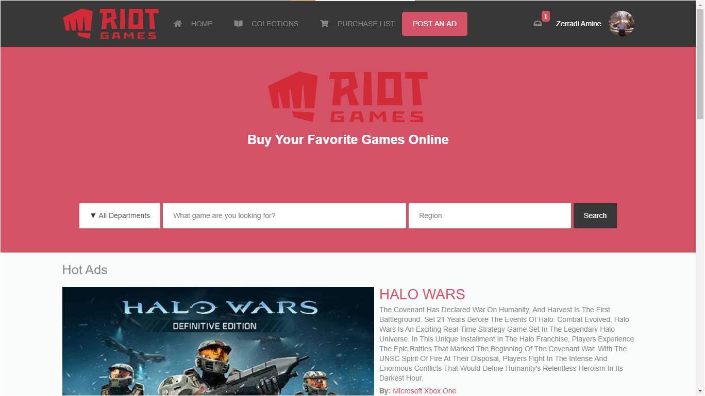

# Capstone Project for Microverse about E-Games Shop

> This is my capstone project which is an online E-Game shop .

Additional description about the project and its features.

## Built With

- HTML
- CSS (LESS)

## Live Demo

[Live Demo Link](https://raw.githack.com/dasileker/capstone-project/featur/index.html)
## Getting Started

Just clone the project and open `index.html` file in chrome.

## Authors

👤 **Author1**

- Github: [@dasileker](https://github.com/dasileker)
- Twitter: [@zerradi](https://twitter.com/zerradi)
- Linkedin: [zerradi](https://www.linkedin.com/in/dasileker)

## Design 

Check it on [behance](https://www.behance.net/gallery/24796463/ZATTIX).

Design idea by [Mohammed Awad on Behance](https://www.behance.net/M_Awad).

## 🤝 Contributing

Contributions, issues and feature requests are welcome!

Feel free to check the [issues page](issues/).

## Show your support

Give a ⭐️ if you like this project!

## 📝 License

This project is [MIT](lic.url) licensed.
