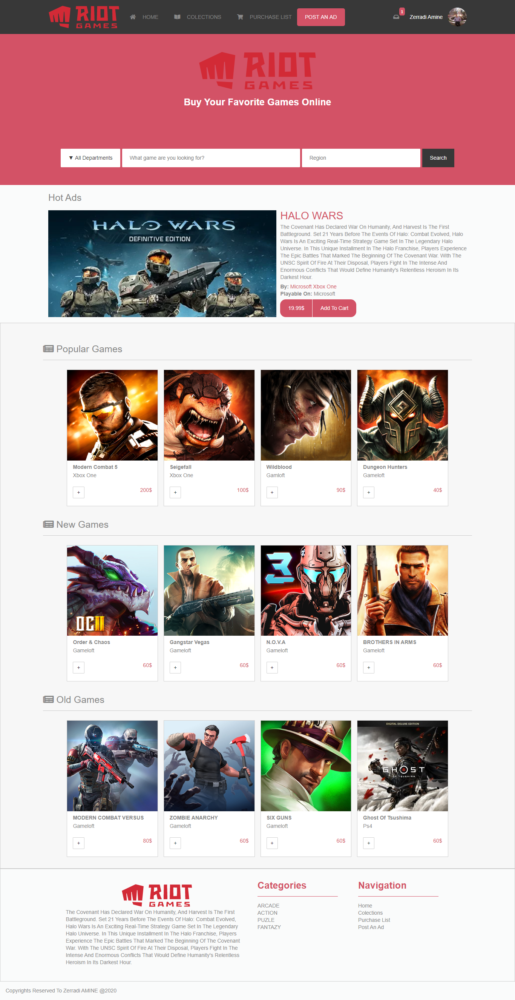

# Capstone Project for Microverse about E-Games Shop

> This is my capstone project which is an online E-Game shop .

Additional description about the project and its features.

## Built With

- HTML
- CSS (LESS)

## project discription

in this project, I was asked to build an E-game website clone that contained popular video game and take the same layout of the Behance website [Behance](https://www.behance.net/gallery/24796463/ZATTIX). so the main idea here is to test our knowledge in CSS and  HTML and Bootstrap.

in my case I built the project just with two things the HTML and CSS, I was very challenging and of course, I was very excited too as you can see in this README.md file a link to my presentation video for the project and a screenshot for the final result of the page, and also the link for the project clone itself I hope you like my project and give a star to it.

thank you MICROVERSE for the opportunity  &  thank you TSE's for the reviews because it was very helpful and also informative.

## Live Demo

[Live Demo Link](https://raw.githack.com/dasileker/capstone-project/featur/index.html)

##  video presentation link

[presantation video Link](https://www.loom.com/share/140b7524bec449ed86a739b9c5ce48a5)

## Authors

👤 **Author1**

- Github: [@dasileker](https://github.com/dasileker)
- Twitter: [@zerradi](https://twitter.com/zerradi)
- Linkedin: [zerradi](https://www.linkedin.com/in/dasileker)

## Design 

Check it on [behance](https://www.behance.net/gallery/24796463/ZATTIX).

Design idea by [Mohammed Awad on Behance](https://www.behance.net/M_Awad).

## 🤝 Contributing

Contributions, issues and feature requests are welcome!

Feel free to check the [issues page](issues/).

## Show your support

Give a ⭐️ if you like this project!

## 📝 License

This project is [MIT](lic.url) licensed.
